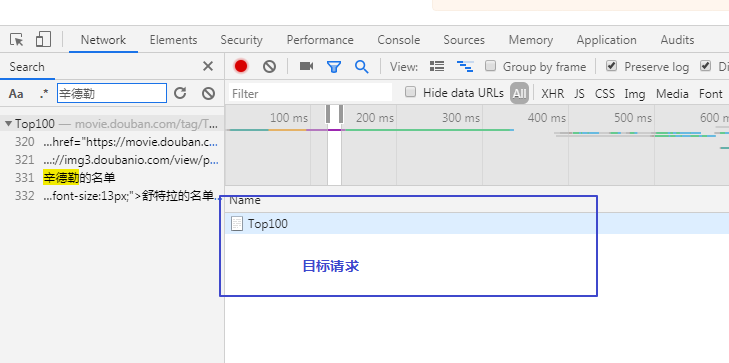
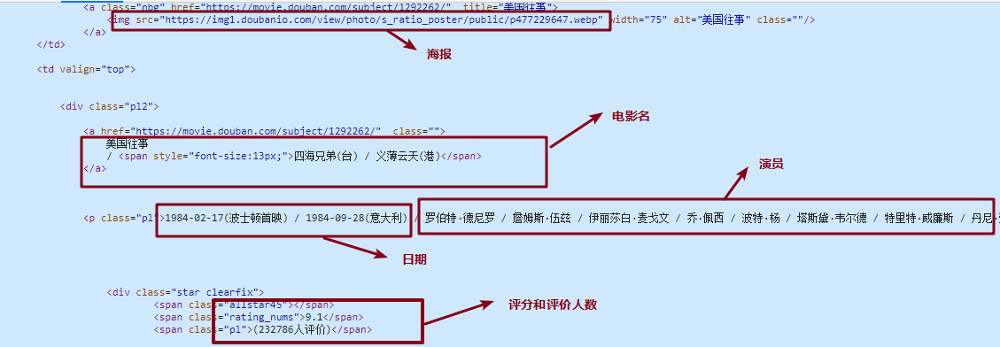

# 豆瓣电影的多方法解析
https://movie.douban.com/tag/Top100  

本项目主要是数据提取的练习,提供了5种数据提取的方式.
### 1. [分析网页](#1-分析网页确认爬取目标的数据类型)  # 需要的数据请求地址分析
### 2. [正则提取](#1-正则提取)  # 正则提取所须数据
### 3. [Css选择器提取](#2-beautifulsoup-css选择器-提取)  # 利用BeautifulSoup4 进行提取
### 4. [Xpath选择器提取](#douban_movie#3-xpath-提取)  # 利用lxml的etree模块进行xpath提取
### 5. [jQuery提取](#4-pyquery的数据提取)  # 有前端的知识的朋友应该很熟悉,利用的是pyquery模块,节点选择语法与jQuery一致
### 6. [Scrapy 混合提取器](#douban_movie#5-scrapy-混合提取)  # 利用scrapy的Selector模块进行混合提取
### 7. [总结](#总结)
#### [完整代码](./douban_spider.ipynb)

### 1. 分析网页，确认爬取目标的数据类型。
   - #### 打开 [目标url](https://movie.douban.com/tag/Top100), 定位数据位置
        
   - #### 定位需要的数据位置，查看爬取目标。  
        
      由图可得，我们需要的数据分别为，['海报', '电影名', '上映日期', '演员', '评分', '评价人数']
   - #### 查看请求，分析数据来源请求（F12 >> network 打开请求界面，如下图）
        
   - #### 确认数据请求来源(Ctrl + F 搜索: 辛德勒)
        
      上图可知，该请求只有一个，所以就能轻松的确定来源拉！ 
   - #### 查看headers，分析请求报文
        
      分析结果如图，所以我们可以得出以下结论：  


| 信息     | 结果                                  |
| :------- | -------------------------------------|
| 请求地址 | <https://movie.douban.com/tag/Top100> |
| 请求方法 | Get                                   |
| 响应格式 | text 文本                             |
| 编码     | UTF-8                                |

## 2. 利用requests进行请求测试
`requests.get`  
定义请求函数，`get_data`  
返回`text`数据  

模块导入
```python
>>> import requests
>>> from requests.exceptions import HTTPError
```


```python
def get_data(url):

    response = requests.get(url)
    if response.status_code == requests.codes.ok:  # 检测状态码
        return response.text  # 返回响应的文本信息
    else:
        response.raise_for_status()  # 4xx 5xx 时,引出错误 代替 raise requests.exception.HTTPError

 url = "https://movie.douban.com/tag/Top100"
data = get_data(url)  # 获取数据
data_res = {}  # 存储数据的初始化字典
data # 查看数据
```
```
<!DOCTYPE html>
<html lang="zh-cmn-Hans" class="ua-windows ua-webkit">
<head>
    <meta http-equiv="Content-Type" content="text/html; charset=utf-8">
......
```

## 3. 提取数据
   - 正则提取
   - BeautifulSoup 提取
   - Xpath 提取
   - pyquery 提取
   - scrapy 混合提取

### 1. 正则提取
- 观察数据位置


导入模块
```python
>>> import re
```

### 提取 海报地址以及电影名称
**通过查看该请求的响应内容快速进行复制匹配,如下图搜索:**
  
用到的匹配规则提示:
   - "." 表示任意非空格换行等字符
   - ".*?"  表示贪婪匹配,最少匹配一次
   - "()"  表示提取()中的内容
   -  "\\w" 表示正常字符,比如英文字母,中文等常见文字
   - ".+"  表示至少匹配一次任意字符


```python
>>> # 设置提取表达式 
>>> poster_pattern = re.compile(r"""<a class="nbg" href=".*?"  title=".*?">.*?.*?</a>""", re.S)  # 海报的正则表达式
>>> movie_name_pattern = re.compile(r""" <div class="pl2">.*? <a href=".*?"  class="">.*?(\w+).*?<span style="font-size:13px;">(.*?)</span>.*?</a>""", re.S)  # 电影名正则表达式
>>> poster_res = re.findall(poster_pattern, data)  # 获取所有匹配结果
>>> movie_name_res = re.findall(movie_name_pattern, data)
>>> poster_res, movie_name_res
......
('https://img3.doubanio.com/view/photo/s_ratio_poster/public/p1910902213.jpg',
'低俗小说'),
('https://img3.doubanio.com/view/photo/s_ratio_poster/public/p1665997400.jpg',
'美丽心灵')],
[('辛德勒的名单', '舒特拉的名单(港) / 辛德勒名单'),
('狩猎', '谎言的烙印(台) / 诬网(港)'),
('美国往事', '四海兄弟(台) / 义薄云天(港)'),
......
```
**查看结果好像没什么问题, 我们用长度比较来看看数量是否一致**


```python
>>> len(poster_res) == len(movie_name_res)
True
```

**长度一致,看来匹配规则在这里没问题**
我们将提取到的数据存储到我们的数据结构`data_res`中


```python
for poster, movie_name in zip(poster_res, movie_name_res):  # 压缩遍历
    # 进行名称验证，是否对应,
    name1 = poster[1]
    name2 = movie_name[0]
    if name1 == name2:
        tmp_dict = data_res.get(name1, {})  # 初始化字典
        tmp_dict.update({"poster": poster[0]})  # 字典更新
        tmp_dict.update({"else_name": movie_name[1]})  # 字典更新
        data_res[name1] = tmp_dict
data_res
```
```
{
'辛德勒的名单': {'poster': 'https://img3.doubanio.com/view/photo/s_ratio_poster/public/p492406163.jpg',
  'else_name': '舒特拉的名单(港) / 辛德勒名单'},
 '狩猎': {'poster': 'https://img1.doubanio.com/view/photo/s_ratio_poster/public/p1546987967.jpg',
  'else_name': '谎言的烙印(台) / 诬网(港)'},
 '美国往事': {'poster': 'https://img1.doubanio.com/view/photo/s_ratio_poster/public/p477229647.jpg',
  'else_name': '四海兄弟(台) / 义薄云天(港)'},
 '十二怒汉': {'poster': 'https://img3.doubanio.com/view/photo/s_ratio_poster/public/p2173577632.jpg',
 ......
 }
```

**我们用同样的方法,提取其他需要的数据**  
***这里有个小技巧,用额外的字段来得到唯一匹配, 如下图:***  
需要的数据:  
   
额外数据匹配:  


#### 整体提取
**由于所有数据都集中在一个块，如下图：**  
  
所有我们就一次性全部提取，方便数据的收集.  
由于有些是电影值有一个年份，所以匹配不好匹配，我们匹配整体后利用"/"进行分割再挑选.  
*PS: 其实正则匹配这种很多字段的容易出错，换行之类的字符容易忘记替代，所以建议一点一点的增加匹配表达式的长度.*


```python
>>> total_pattern = re.compile("""<p class="ul">.*?<a class="nbg" href=".*?"  title="(.*?)">.*?.*?<a href=".*?"  class="">.*?(\w+).*?style="font-size:13px;">(.*?)</span>.*?class="pl">(.*?)</p>.*?class="star clearfix">.*?"allstar45"></span>.*?"rating_nums">(.*?)</span>.*?<span class="pl">\((.*?)\)</span>.*?<div id=".*?"></div>""", re.S)
>>> res = re.findall(total_pattern, data)
>>> res
```


```
[
('狩猎',
  'https://img1.doubanio.com/view/photo/s_ratio_poster/public/p1546987967.jpg',
  '狩猎',
  '谎言的烙印(台) / 诬网(港)',
  '2012-05-20(戛纳电影节) / 2013-01-10(丹麦) / 麦斯·米科尔森 / 托玛斯·博·拉森 / 安妮卡·韦德科普 / 拉丝·弗格斯托姆 / 苏西·沃德 / 安妮·路易丝·哈辛 / 拉斯·兰特 / 亚历山德拉·拉帕波特 / 拉斯穆斯·林德·鲁宾 / 丹麦 / 瑞典 / 托马斯·温特伯格...',
  '9.1',
  '184560人评价'),
 ('美国往事',
  'https://img1.doubanio.com/view/photo/s_ratio_poster/public/p477229647.jpg',
  '美国往事',
......
]
```


#### 观察整体数据情况，提取数据  


```python
def get_time_actor(data):
    """
    获取处理后的时间和演员数据
    :param data: 
    :return: 
    """
    tmp_data = data.split(" / ")
    ind = 1
    for i, v in enumerate(tmp_data):
        if v[:4].isdigit():  # 判断是否为数字
            ind += 1
        else:
            break
        return tmp_data[:ind], tmp_data[ind:]
```


```python
for tmp_data in res:
    tmp = data_res.get(tmp_data[0], {})  # 获取原来的字典数据
    if tmp_data[0] == tmp_data[2]:  # 检测数据是否对齐
        tmp.update({"movie_name": tmp_data[0], "poster_url": tmp_data[1], "other_name": tmp_data[3], "score": float(tmp_data[-2]), "comment_people": tmp_data[-1].replace("人评价", "")})  # 更新数据
        time_data, actor = get_time_actor(tmp_data[-3])
        tmp.update({"release_time": time_data, "actor": actor})
        data_res[tmp_data[0]] = tmp
    else:
        print("数据有误")
print(data_res)
```
```
    {
    '辛德勒的名单': {'poster': 'https://img3.doubanio.com/view/photo/s_ratio_poster/public/p492406163.jpg', 'else_name': '舒特拉的名单(港) / 辛德勒名单'}, '狩猎': {'poster': 'https://img1.doubanio.com/view/photo/s_ratio_poster/public/p1546987967.jpg', 'else_name': '谎言的烙印(台) / 诬网(港)', 'movie_name': '狩猎', 'poster_url': 'https://img1.doubanio.com/view/photo/s_ratio_poster/public/p1546987967.jpg', 'other_name': '谎言的烙印(台) / 诬网(港)',
    .....
    }
```

## 2. BeautifulSoup （css选择器） 提取

导入模块
```python
>>> from bs4 import BeautifulSoup
```


```python
>>> soup = BeautifulSoup(data, "lxml")  # 初始化soup对象
```

#### 利用css选择器逐一获取数据
**poster**: `".nbg img"`  
**movie_name**: `".pl2 a"`  
**time_actor**: `".pl2 p.pl"`  
**score**: `".rating_nums"`  
**comment_people**: `".star.clearfix .pl"`   


***PS:***  
- "." 表示class 
- " "表示子孙节点  
- img 就是img节点  
- a 就是a节点
- "#abd" 表示 id="abc"的节点


```python
>>> poster = soup.select(".nbg img")  # 海报
>>> movie_name = soup.select(".pl2 a")  # 电影名称
>>> time_actor = soup.select(".pl2 p.pl")  # 上映时间及演员
>>> score = soup.select(".rating_nums")  # 电影评分
>>> comment_people = soup.select(".star.clearfix .pl")  # 评分人数
>>> movie_data = {}  # 存储结构
```

#### 批量获取数据


```python
for p, m, t, s, c in zip(poster, movie_name, time_actor, score, comment_people):
    pos = p.get("src")  # 海报地址
    mov = m.get_text().replace(m.select("span")[0].get_text(), "")  # 电影名称
    mov = mov.replace("/", "").strip()  # 去掉不需要的字符
    other_name = m.select("span")[0].get_text()  # 额外名字
    release_time, actor = get_time_actor(t.get_text())
    sco = s.get_text()
    comment = c.get_text()
    movie_data.update({mov: {"poster": pos, "movie_name": mov, "other_name": other_name, "release_time": release_time, "actor": actor, "score": sco, "comment": comment}})
print(movie_data)
```
```
    {
    '辛德勒的名单': {'poster': 'https://img3.doubanio.com/view/photo/s_ratio_poster/public/p492406163.jpg', 'movie_name': '辛德勒的名单', 'other_name': '舒特拉的名单(港) / 辛德勒名单', 'release_time': ['1993-11-30(华盛顿首映)', '1994-02-04(美国)'], 'actor': ['连姆·尼森', '本·金斯利', '拉尔夫·费因斯', '卡罗琳·古多尔', '乔纳森·萨加尔', '艾伯丝·戴维兹', '马尔戈萨·格贝尔', '马克·伊瓦涅', '碧翠斯·马科拉', '安德烈·瑟韦林', '弗里德里希·冯·图恩', '克齐斯茨托夫·拉夫特...'], 'score': '9.5', 'comment': '(571888人评价)'}, '狩猎': {'poster': 'https://img1.doubanio
    ......
    }
```

## 3. Xpath 提取


```python
>>> from lxml import etree  # 导入xpath模块
```


```python
>>> xpath_data = etree.HTML(data)  # 初始化xpath结构
```

可以直接在浏览器中试xpath表达式,如下图:  
  
**下例用到的xpath语法解释:**  
 - "//"  # 代表从根节点搜索
 - "//a"  # 搜索根节点的所有a标签
 - "//a[@class="nbg]"  # 搜索class="nbg"的a标签
 - ".../a"  # 搜索从...节点开始的子a标签
 - ".../img/@src"  # 获取当前img标签的src属性
 - ".../p/text()"  # 获取当前p标签下的文本
 - ".../p//text()"  # 获取当前p标签后的所有文本(子孙文本)


```python
>>> poster = xpath_data.xpath('//a[@class="nbg"]/img/@src')  # 获取海报
>>> movie_name = xpath_data.xpath('//div[@class="pl2"]/a/text()')  # 获取电影名
>>> other_name = xpath_data.xpath('//div[@class="pl2"]/a/span/text()')  # 获取电影别名
>>> time_actor = xpath_data.xpath('//div[@class="pl2"]/p/text()')  # 获取时间和演员
>>> score = xpath_data.xpath('//span[@class="rating_nums"]/text()')  # 获取评分
>>> comment_people = xpath_data.xpath('//span[@class="pl"]/text()')  # 评分人数
>>> movie_data = {}
```

#### 同样进行数据收集


```python
for p, m, o, t, s, c in zip(poster, movie_name, other_name, time_actor, score, comment_people):
    m = m.replace("/", "").strip()
    release_time, actor = get_time_actor(t)
    movie_data.update({m: {"poster": p, "movie_name": m, "other_name": t, "release_time": release_time, "actor": actor, "score": s, "comment": c}})
print(movie_data)
```
```
    {
    '辛德勒的名单': {'poster': 'https://img3.doubanio.com/view/photo/s_ratio_poster/public/p492406163.jpg', 'movie_name': '辛德勒的名单', 'other_name': '1993-11-30(华盛顿首映) / 1994-02-04(美国) / 连姆·尼森 / 本·金斯利 / 拉尔夫·费因斯 / 卡罗琳·古多尔 /
    ......
    }
```

## 4. Pyquery 的数据提取
主要利用jquery的定位方式，  
如 ".name" 表示 class="name"   
"#name" 表示 id="name"  
以下例子中:
  - "a.nbg"  # 表示 a class="nbg"
  - "a img"  # 表示 a标签的子孙img标签
  - .remove()  # 表示移除该节点
  - .items()  # 当选中多个节点时,需要使用.items() 生成可遍历对象再进行提取
  - .attr()  # 表示获取标签
  - .text()  # 表示获取文本


```python
>>> from pyquery import PyQuery as pq
```


```python
>>> query_data = pq(data[:])  # 因为为了便于提取,需要删除节点,避免破坏元数据,拷贝一份
```


```python
>>> poster = (i.attr["src"] for i in query_data("a.nbg img").items())  # 获取海报
>>> other_name = [i.text() for i in query_data("div.pl2 a span").items()]  # 获取别名
>>> query_data("div.pl2 a span").remove()  # 移除别名节点
>>> movie_name = (i.text().strip("/").strip() for i in query_data("div.pl2 a").items())  # 获取电影名
>>> time_actor =  (i.text() for i in query_data("div.pl2 p").items())  # 获取上映时间和演员
>>> score = (i.text() for i in query_data("span.rating_nums").items())  # 获取评分
>>> comment_people = (i.text() for i in query_data("span.pl").items())  # 获取评价人数
>>> movie_data = {}
```


```python
for p, m, o, t, s, c in zip(poster, movie_name, other_name, time_actor, score, comment_people):
    release_time, actor = get_time_actor(t)
    movie_data.update({m: {"poster": p, "movie_name": m, "other_name": t, "release_time": release_time, "actor": actor, "score": s, "comment": c}})
print(movie_data)
```
```
    {
    '辛德勒的名单': {'poster': 'https://img3.doubanio.com/view/photo/s_ratio_poster/public/p492406163.jpg', 'movie_name': '辛德勒的名单', 'other_name': '1993-11-30(华盛顿首映) / 1994-02-04(美国) / 连姆·尼森 / 本·金斯利 / 拉尔夫·费因斯 / 卡罗琳·古多尔 / 乔纳森·萨加尔 / 艾伯丝·戴维兹 / 马尔戈萨·格贝尔 / 马克·伊瓦涅 / 碧翠斯·马科拉 / 安德烈·瑟韦林 / 弗里德里希·冯·图恩 / 克齐斯茨托夫·拉夫特...', 'release_time':
    ......
    }
```

## 5. scrapy 混合提取


```python
>>> from scrapy import Selector  # 导入scrapy的选择器
```


```python
>>> se = Selector(text=data)
```

#### 提取规则说明 从下方案例可以看出,scrapy的提取器,css和xpath,以及正则提取都是支持的,我们可以混用  
   - .css()  # 就是css规则的提取
   - .xpath()  # 就是xpath规则的提取,需要注意的是,因为scrapy的Selector支持混用,如果xpath是在某个提取器之后,那么必须使用"./"来跟进上个提取器的提取点,不能使用"//", 因为Selector 的xapth提取器的"//"永远代表根节点
       - response.css("#id").xpath("./a")  # 该规则表示id="id" 的节点**之后**的所有a标签节点
       - response.css("#id").xpath("//a")  # 改规则就变成了提取所有的a标签节点,前面的css选择器的结果失效.
   - .re()  # 就是正则的提取, 正则提取后,不需要用extract()来转化成str类型
   - extract()  # 将当前的选择结果转化成str类型  


```python
>>> poster = se.css(".nbg img").xpath("./@src").extract()  # 获取海报
>>> movie_name = se.css("div.pl2").xpath("./a/text()").re("\w+")  # 获取电影名
>>> other_name = se.css("div.pl2").xpath("./a/span/text()").extract()  # 获取电影别名
>>> time_actor = se.css("div.pl2").xpath("./p/text()").extract()  # 获取上映日期和演员
>>> score = se.css("span.rating_nums::text").extract()  # 获取评分
>>> comment_people = se.xpath('//span[@class="pl"]/text()').extract()  # 获取评分人数
>>> movie_data = {}
```


```python
for p, m, o, t, s, c in zip(poster, movie_name, other_name, time_actor, score, comment_people):
    release_time, actor = get_time_actor(t)
    movie_data.update({m: {"poster": p, "movie_name": m, "other_name": t, "release_time": release_time, "actor": actor, "score": s, "comment": c}})
print(movie_data)
```
```
    {
    '辛德勒的名单': {'poster': 'https://img3.doubanio.com/view/photo/s_ratio_poster/public/p492406163.jpg', 'movie_name': '辛德勒的名单', 'other_name': '1993-11-30(华盛顿首映) / 1994-02-04(美国) / 连姆·尼森 / 本·金斯利 / 拉尔夫·费因斯 / 卡罗琳·古多尔 / 乔纳森·萨加尔 / 艾伯丝·戴维兹 / 马尔戈萨·格贝尔 / 马克·伊瓦涅 / 碧翠斯·马科拉 / 安德烈·瑟韦林 / 弗里德里希·冯·图恩 / 克齐斯茨托夫·拉夫特...', 'release_time': ['1993-11-30(华盛顿首映)', '1994-02-04(美国)'], 'actor': ['连姆·尼森', '本·金斯利', '拉尔夫·费因斯',
    ......
    }
```

## 总结
以上就是我们该次提取练习的所有内容,以豆瓣电影top100的响应为例,我们讲解了常用的5种提取器.  
**1. 正则**  
   - "." 表示任意非空格换行等字符
   - ".*?"  表示贪婪匹配,最少匹配一次
   - "()"  表示提取()中的内容
   -  "\\w" 表示正常字符,比如英文字母,中文等常见文字
   - ".+"  表示至少匹配一次任意字符  

**2. css**  
- "." 表示class 
- " "表示子孙节点  
- img 就是img节点  
- a 就是a节点
- "#abd" 表示 id="abc"的节点

**3. xpath**  
 - "//"  # 代表从根节点搜索
 - "//a"  # 搜索根节点的所有a标签
 - "//a[@class="nbg]"  # 搜索class="nbg"的a标签
 - ".../a"  # 搜索从...节点开始的子a标签
 - ".../img/@src"  # 获取当前img标签的src属性
 - ".../p/text()"  # 获取当前p标签下的文本
 - ".../p//text()"  # 获取当前p标签后的所有文本(子孙文本)

**4. pyquery**  
  - "a.nbg"  # 表示 a class="nbg"
  - "a img"  # 表示 a标签的子孙img标签
  - .remove()  # 表示移除该节点
  - .items()  # 当选中多个节点时,需要使用.items() 生成可遍历对象再进行提取
  - .attr()  # 表示获取标签
  - .text()  # 表示获取文本

**5. 混合提取**  
   - .css()  # 就是css规则的提取
   - .xpath()  # 就是xpath规则的提取,需要注意的是,因为scrapy的Selector支持混用,如果xpath是在某个提取器之后,那么必须使用"./"来跟进上个提取器的提取点,不能使用"//", 因为Selector 的xapth提取器的"//"永远代表根节点
       - response.css("#id").xpath("./a")  # 该规则表示id="id" 的节点**之后**的所有a标签节点
       - response.css("#id").xpath("//a")  # 改规则就变成了提取所有的a标签节点,前面的css选择器的结果失效.
   - .re()  # 就是正则的提取, 正则提取后,不需要用extract()来转化成str类型
   - extract()  # 将当前的选择结果转化成str类型  
#### [完整代码](./douban_spider.ipynb)